<div align="center">


</div>

## Что это такое

SimCom - программно-определяемый эмулятор 16-битного процессора с веб-IDE прямо в браузере. По сути это «аквариум для чисел»: изолированная цифровая среда со своими законами физики, построенная на обычном Python.

Внутри - полноценная архитектура фон Неймана: конвейер fetch-decode-execute, 23 ассемблерных инструкции, сегментированная память с аппаратной защитой через собственный MMU и арифметика дополнительного кода с детекцией переполнения. Весь стек - Flask API на бэкенде, React SPA на фронтенде, Docker Compose для запуска одной командой.

---

## Архитектура

```
 ┌──────────────┐     Шина адреса (9-бит)     ┌──────────────┐
 │              │ ──────────────────────────► │              │
 │  CPU + ALU   │     Шина данных (16-бит)    │  RAM  512W   │
 │  18 регистров│ ◄─────────────────────────► │  CS/DS/SS    │
 │              │     Шина управления         │              │
 └──────┬───────┘ ──────────────────────────► └──────────────┘
        │
   ┌────┴─────────────────┐
   │       Слой I/O       │
   │  Stream In  (INT 0)  │  Stream Out  (INT 1)
   └──────────────────────┘
```

### Карта памяти

| Диапазон адресов | Сегмент | Доступ |
|---|---|---|
| `0x000 – 0x001` | Векторы прерываний | Зарезервировано системой |
| `0x002 – 0x0AB` | Стек (SS) | Только PUSH / POP / CALL / RET |
| `0x0AC – 0x155` | Данные (DS) | Чтение/запись через MOV, INT |
| `0x156 – 0x1FF` | Код (CS) | Только чтение во время выполнения |

Адресное пространство: 512 слов (9-битная шина). Каждая ячейка хранит одно знаковое 16-битное значение.

Сегменты разбиты равномерно - по 170 ячеек на стек, данные и код. Это осознанное решение: программа средней сложности занимает 40–60 строк, стандартный набор данных - 20–50 ячеек, а глубина вложенных вызовов редко превышает 20–30 уровней. Каждый сегмент перекрывает потребности с трехкратным запасом.

### MMU - трансляция адресов

С версии 2.5 программа больше не обращается к памяти по абсолютным адресам - вместо этого она адресует свой сегмент смещением от нуля, как будто он всегда начинается с начала памяти. Перевод смещения в физический адрес берет на себя отдельный класс `MMU`, живущий рядом с `SimPC`:

```python
def translate(self, base, offset, segment_name):
    if not (0 <= offset < self.sizes[segment_name]):
        raise MemoryAccessViolation(...)
    return base + offset
```

Формула та же, что в реальном режиме x86: `physical = base + offset`, только без параграфов по 16 байт. Для программы `mov 0 ax` значит «первая ячейка моих данных», а физически это адрес 172 (начало DS). Для `jmp 3` - «третья команда моей программы», а не абсолютный адрес где-то в CS.

У MMU два режима проверки. `translate(base, offset, segment)` - для случаев, когда есть смещение и нужно посчитать физический адрес (MOV, JMP, JCX, JZ, CALL). `check_range(addr, segment)` - для случаев, когда адрес уже физический и его нужно просто проверить на принадлежность сегменту (SP при PUSH/POP/CALL/RET). Оба метода кидают `MemoryAccessViolation`, если адрес вышел за границы - ни один обработчик команды не трогает `self.memory` напрямую, минуя MMU.

Смысл этого слоя не в производительности - в изоляции. Раньше границы сегментов проверялись россыпью условий прямо в обработчиках команд, и по мере роста ISA это стало неуправляемым (баг v2.4 с `[bx]`/`[si]` - прямое следствие). Теперь любая адресация - MOV, косвенная адресация, переходы, стек - идет через одну и ту же точку контроля.

---

## Ключевые особенности

**Аппаратная защита памяти.** CS заблокирован от записи на уровне ядра. Любая команда MOV, нацеленная на адрес `>= 0x156`, вызывает критическую ошибку и немедленно останавливает конвейер. Переполнение и опустошение стека перехватываются до того, как SP добирается до векторов прерываний.

**АЛУ на дополнительном коде.** Вся арифметика знаковая. Фильтр `math_op` зажимает каждый результат в 16-битный знаковый диапазон `[−32768, 32767]` и автоматически обновляет флаги:

```python
def math_op(self, raw):
    val = (raw + 0x8000) % 0x10000 - 0x8000
    self.registers['zf'] = 1 if val == 0 else 0
    self.registers['of'] = 1 if raw != val else 0
    return val
```

Число `0x8000` используется как смещение, чтобы временно перевести шкалу вычислений в положительную область - операция `%` нестабильна с отрицательными числами в ряде языков. После взятия остатка смещение вычитается обратно.

**Конвейер fetch-decode-execute.** Одна инструкция за такт. Блок управления считывает ячейку по адресу IP, немедленно инкрементирует IP (чтобы шина адреса освободилась к следующему такту), декодирует опкод через таблицу диспетчеризации `self.coms` и передает управление соответствующему обработчику. Нераспознанные опкоды классифицируются как синтаксические ошибки еще до фазы выполнения.

**Изолированные сессии через заголовок.** Каждый экземпляр эмулятора привязан к значению заголовка `X-Client-Id`, а не к cookie. Регистры, память и флаги никогда не пересекаются между пользователями. Неактивные сессии автоматически удаляются через 2 часа по TTL-механизму.

**Контроль системных инвариантов.** После каждой выполненной инструкции `check_invariants()` проверяет пять условий: SP в границах стека, отсутствие чисел в CS, регистры общего назначения в 16-битном диапазоне, IP внутри CS во время исполнения, неизменность CS/DS/SS. Нарушение любого из них означает баг не в программе пользователя, а в самом эмуляторе - машина останавливается и печатает, какой именно инвариант сломался.

**Регистровый файл - 18 регистров.** Регистры общего назначения: `AX`, `BX`, `CX`, `DX`. Указатели: `IP`, `SP`. Индексные: `SI`, `DI`. Сегментные константы: `CS`, `DS`, `SS`. Флаги: `ZF` (ноль), `OF` (переполнение 16-бит), `CE` (критическая ошибка, блокирует конвейер). Задел на будущее: `BP` (базовый указатель для стековых кадров).

---

## Система команд (ISA v2.5)

23 операции в 5 категориях.

| Категория | Команды |
|---|---|
| Передача данных | `MOV`, `PUSH`, `POP` |
| Арифметика | `ADD`, `SUB`, `MUL`, `DIV`, `INC`, `DEC`, `NEG` |
| Битовая логика | `AND`, `OR`, `XOR`, `NOT` |
| Управление потоком | `CMP`, `JMP`, `JCX`, `JZ`, `LOOP`, `CALL`, `RET` |
| Ввод/вывод | `INT`, `END` |

Нюансы поведения:
- `AND`, `OR`, `XOR`: результат всегда пишется в `CX` - чтобы не занимать аккумулятор `AX` и сразу использовать в командах цикла.
- `LOOP addr`: сначала декрементирует `CX`, затем прыгает если `CX > 0`. Вход с `CX = 0` - холостой ход.
- `JZ addr`: прыжок только если `ZF = 1`, то есть последняя операция дала ноль. Без нее `CMP` был наполовину бесполезен - сравнить можно было, а условно прыгнуть по результату нет.
- `INT 0`: читает из входного буфера в `memory[BX]`. `INT 1`: пишет `memory[BX]` в выходной буфер. `BX` должен указывать в DS (`0x0AC – 0x155`).
- `JMP`, `JCX`, `JZ`, `CALL`: операнд - смещение внутри CS (0 значит первая команда программы), MMU сам переводит его в физический адрес и проверяет границы.
- Косвенная адресация через `[BX]`, `[SI]`, `[DI]`, `[BP]`: содержимое регистра интерпретируется MMU как смещение в своем сегменте - `[BX]`/`[SI]`/`[DI]` смотрят в DS, `[BP]` смотрит в SS.

---

## Модули: как устроено изнутри

### Модуль 1 - Глобальное устройство

SimCom построен по принципу фон Неймана: инструкции и данные живут в одном адресном пространстве - едином списке `self.memory` на 512 ячеек. Никакой физической разницы между ячейкой с командой и ячейкой с числом не существует - только логика сегментации на уровне контроля.

В основе ядра лежит детерминированный конечный автомат. Два одинаковых состояния + одна и та же команда = гарантированно одинаковый результат. Никакой случайности. Метод `run_step()` - это тактовый генератор: он считывает инструкцию, меняет значения в структурах данных и фиксирует новое стабильное состояние.

Выбор 16-бит - осознанный компромисс. Диапазон `[−32768, 32767]` достаточен для любых учебных алгоритмов, числа остаются читаемыми в интерфейсе, а сама архитектура прямо отсылает к легендарному Intel 8086 - фундаменту всей линейки x86.

### Модуль 2 - Память

512 ячеек - не случайное число. Это точно `2⁹`, то есть для адресации нужно ровно 9 бит. Такой объем позволяет отобразить всю карту памяти в сетку 16×32 - она целиком умещается на одном экране браузера без прокрутки. Именно это критично для отладки: студент видит движение данных по всей памяти в реальном времени.

Инициализация памяти (`gen_mem`) заполняет все 512 ячеек пустыми строками. Пустая строка - маркер неинициализированной зоны. Если процессор наткнется на такую ячейку в сегменте кода, сработает защита и конвейер остановится.

Защита памяти в v2.5 переехала из точечных проверок внутри команд в отдельный класс `MMU`. Прежде чем любая команда коснется `self.memory` - напрямую (`MOV` по смещению) или косвенно (`[BX]`, `[SI]`, `[DI]`, `[BP]`) - адрес проходит через `mmu.translate()` или `mmu.check_range()`. Запись в системные ячейки (0–1) и в сегмент кода блокируется еще на этапе трансляции смещения: `MemoryAccessViolation` вылетает раньше, чем обработчик команды успевает прикоснуться к списку `memory`.

### Модуль 3 - Регистры

**Регистры общего назначения** (`AX`, `BX`, `CX`, `DX`) - 16-битные ключи в словаре `self.registers`. За каждым закреплена роль:

- `AX` - главный аккумулятор, центральный узел для потока чисел
- `BX` - базовый указатель; команды `INT 0` и `INT 1` аппаратно требуют адрес в `BX`
- `CX` - счетчик циклов; `LOOP` и `JCX` завязаны на него, сюда же принудительно пишутся результаты `AND`/`OR`/`XOR`
- `DX` - универсальный буфер, «запасной карман» для промежуточных данных

**Указатели** (`IP`, `SP`). IP при сбросе ставится на 342 (начало CS). Инкремент IP происходит сразу после фазы Fetch, до декодирования - так шина адреса освобождается к следующему такту. Команды ветвления просто перезаписывают уже инкрементированный IP новым адресом. SP стартует на 171 и растет вниз: PUSH - декремент потом запись, POP - чтение потом инкремент.

**Индексные регистры** (`SI`, `DI`) добавлены во второй версии. В связке с косвенной адресацией `[SI]` / `[DI]` они превращаются в динамические указатели для работы с массивами. Одна команда `MOV AX [SI]` внутри цикла с `INC SI` заменяет сотню одинаковых строк.

**Флаги** (`ZF`, `OF`, `CE`). `ZF` и `OF` обновляются автоматически после каждой арифметической операции - пользователь не может менять их через `MOV`. `CE` - предохранитель: делит на ноль, обращение к пустой ячейке, выход IP за границы - все это зажигает `CE` и блокирует `is_run`.

**Регистр `BP`** присутствует в файле и в интерфейсе, но пока не активен. Это задел на будущее - для стековых кадров и поддержки локальных переменных функций на уровне C-подобного кода. В MMU для него уже зарезервирован отдельный режим адресации - косвенный доступ через `[BP]` смотрит в SS, а не в DS, как остальные регистры-указатели.

**Служебные регистры** (`CI`, `IR`, `NT`) в интерфейсе не показываются и напрямую пользователю недоступны. `CI` хранит токены текущей декодированной инструкции между fetch и execute, `IR` и `NT` зарезервированы под будущее расширение системы прерываний. Все три - в списке защищенных: `MOV` в них попадет в аварийную остановку.

### Модуль 4 - Конвейер

**Fetch.** Блок управления берет ячейку `memory[IP]` и копирует ее в регистр текущей инструкции `CI`. IP сразу же инкрементируется. Если IP улетает за пределы 512 - аппаратное исключение еще до попытки декодировать что-либо.

**Decode.** Ядро берет первое слово из `CI` и ищет его в словаре `self.coms`. Словарь - хеш-таблица, поиск за O(1) независимо от размера ISA. Если слово не найдено - неизвестная команда, флаг `CE`, конвейер стоп. Никаких цепочек `if-elif`.

**Execute.** Управление передается методу-обработчику командой `self.coms[cmd]()`. Арифметика → АЛУ и `math_op`. Передача данных → `self.memory` через `_mem_access_ok`. Прыжки → перезапись `IP`. Такт считается завершенным при возврате из обработчика.

Весь цикл изолирован: никакие внешние изменения не могут произойти в середине такта. Это гарантирует детерминированность модели.

**Корректировка в интерфейсе.** Поскольку IP «бежит вперед», во Flask-ответе применяется формула `cur_line = ip – cs – 1` - чтобы подсветка в редакторе указывала на инструкцию, которая сейчас выполняется, а не на следующую.

**Проверка инвариантов после такта.** В конце `run_step()` вызывается `check_invariants()` - контрольный список из пяти условий (границы SP, отсутствие чисел в CS, диапазон регистров общего назначения, нахождение IP внутри CS во время выполнения, неизменность CS/DS/SS). Это не защита от пользователя - это защита от самого себя: если какой-то из этих пунктов нарушен, значит ошибка не в загруженной программе, а в самом ядре эмулятора, и машина обязана немедленно остановиться и сообщить, что именно сломалось, а не продолжать работу с испорченным состоянием.

### Модуль 5 - Система команд

Система из 22 инструкций Тьюринг-полна - достаточно для любого вычислимого алгоритма, от сортировки до рекурсии.

**Работа со стеком.** Стек растет вниз - индустриальный стандарт x86. `PUSH`: декремент SP → запись по новому адресу. `POP`: чтение по текущему SP → инкремент. Если SP опускается до 2 - Stack Overflow (под ним векторы прерываний). Если `POP` пытается выйти за 171 - Stack Underflow.

**Управление потоком.** `JMP`, `JCX`, `JZ` принимают смещение внутри CS и отдают его в `mmu.translate()`, который считает физический адрес и проверяет границы, прежде чем перезаписать IP. `JCX` прыгает только при `CX == 0`, `JZ` - только при `ZF == 1`. `LOOP` сначала декрементирует `CX`, потом проверяет условие - строго как x86.

**Подпрограммы.** `CALL` сохраняет текущий (уже инкрементированный) IP на стек, затем прыгает. `RET` читает адрес возврата со стека и пишет прямо в IP без промежуточных регистров - баг с затиранием `AX` из v1.8 исправлен именно так.

**Косвенная адресация.** Парсер в `computer.py` детектирует `[REG]` через `src.startswith('[') and src.endswith(']')`, извлекает имя регистра, получает адрес из словаря и обращается к `self.memory`. Каждый косвенный запрос проходит через `_mem_access_ok`.

### Модуль 6 - АЛУ и переполнение

**Дополнительный код.** Чтобы представить `-5`, ядро инвертирует биты числа `5` и прибавляет 1. В результате `SUB AX BX` технически является `ADD AX (–BX)`. Сложение двух дополнений автоматически дает правильный знак - отдельный блок вычитания не нужен.

**Переполнение 32767 + 1.** Python-арифметика вернет 32768. Фильтр `math_op` применит формулу `(32768 + 0x8000) % 0x10000 – 0x8000` и получит `–32768`. Именно это окажется в регистре - полная симуляция поведения реального железа.

**Битовая логика.** `AND`/`OR`/`XOR` принудительно пишут результат в `CX` - разгружают `AX` и сразу дают возможность использовать итог в `JCX` или `LOOP`. `NOT` - унарная операция, меняет операнд на месте. Все четыре проходят через `math_op` для гарантии 16-битного диапазона.

**Аппаратные ловушки.** `CE` активируется при: делении на ноль (`DIV`), ошибке сегментации (`MOV` в защищенную область), попытке выполнить пустую ячейку, выходе IP за пределы диапазона. В `run_step` поверх всего этого стоит глобальный `try-except` - последняя линия обороны, гарантирующая, что сервер Flask никогда не упадет из-за ошибки в пользовательском коде.

### Модуль 7 - Веб-интеграция

**Асинхронный I/O.** Стандартный `input()` блокирует поток - не подходит для веба. Вместо него - два независимых буфера: `stream_in` (FIFO-очередь) и `stream_out` (накопитель логов). Фронтенд добавляет данные POST-запросом; `INT 0` читает из очереди по адресу в `BX`; `INT 1` записывает в очередь из адреса в `BX`. Пустой `stream_in` при попытке чтения → `CE` и стоп.

**Изоляция сессий.** Изначально идентификатор пользователя жил в cookie-сессии Flask. От этого пришлось отказаться: связка `sim-com.ru` + `onrender.com` + Cloudflare вела себя непредсказуемо из-за политики `SameSite`, и состояние периодически слетало (баг v2.2). Теперь клиент сам генерирует UUID4 на фронтенде и присылает его в заголовке `X-Client-Id` с каждым запросом. В `app.py` - глобальный словарь `user_sessions`, где под каждым ключом живет независимый экземпляр `SimPC`. Сотни пользователей могут одновременно запускать разные программы: их данные физически разделены в памяти сервера. TTL-очистка в `get_user_env` удаляет объекты без активности дольше 2 часов при каждом новом запросе.

**JSON-протокол.** Метод `build_state` упаковывает полный снимок машины в один словарь: все 18 регистров, 512 ячеек памяти (инструкции собираются `join` из токенов обратно в строки), буферы I/O, флаги `is_ready`/`is_run`, скорректированный `cur_line`. Flask отдает это через `jsonify()`. Ядро ничего не знает о том, как выглядит сайт - слабая связанность позволяет полностью переписать фронтенд, не трогая логику.

**Фронтенд на React.** SPA на базе Vite. Хук `useState` хранит точную копию стейт-машины бэкенда. Хук `useEffect` следит за обновлениями `stream_out` (авто-скролл), синхронизирует подсветку строки кода и выполняет начальную загрузку. Метод `doStep` - async/await, обращается к Flask, получает JSON, вызывает `setState`, React делает diffing и обновляет только изменившиеся части DOM. Брейкпоинты хранятся в `Set`; auto-run реализован через `setInterval` с проверкой совпадения строки.

**Защита от перегрузки.** Три уровня: `MAX_CONTENT_LENGTH = 50КБ` на уровне WSGI отрезает тяжелые запросы на уровне протокола (ошибка 413). `MAX_CODE_LINES = 200` - ограничение на количество строк кода; хватает для сложных 16-битных программ, но недостаточно для зависания React. TTL-очистка сессий - автосборка мусора для долгоживущих инсталляций.

---

## Быстрый старт

Нужен только Docker и Docker Compose.

```bash
git clone https://github.com/irumka/simcom.git
cd simcom
docker-compose up --build
```

Открыть `http://localhost:5173` в браузере. Flask API слушает порт `5000`, React-фронтенд - `5173`.

---

## История версий

### v2.5 - Июль 2026 (текущая)
Продвинутый архитектурный и защитный слой. Полная интеграция сегментного MMU с динамической трансляцией адресов - программа больше не знает абсолютных адресов, только смещения внутри своего сегмента. Cookie-сессии заменены на изоляцию через заголовок `X-Client-Id`, решена проблема гонки данных при деплое в Docker-контейнер. Реализован изолированный контроль границ стека и защита сегмента кода. Добавлен механизм непрерывного контроля системных инвариантов (`check_invariants`). Новая инструкция `JZ`.

### v2.0 - Апрель 2026
Полный рефакторинг стека. Монолитные Flask-шаблоны заменены на REST API + React SPA на Vite. Docker Compose контейнеризирует все окружение. Добавлена косвенная адресация через `[BX]`, расширены операнды АЛУ до `SI` и `DI`, аппаратно внедрена защита CS от записи, исправлена семантика `LOOP` под стандарт x86.

### v1.5 - Июнь 2024
Архитектурная стабилизация. Многопользовательский доступ через Flask-сессии. Введена сегментация памяти: границы CS, DS, SS определены и принудительно соблюдаются. Добавлена обработка аппаратных исключений через флаг `CE`.

### v1.0 - Август 2023
Первый прототип. Python-ядро эмулятора написано с нуля. Первая спецификация ISA. Монолитный Flask-сервер с серверными шаблонами.

---

## Журнал багов

**`v1.2` - ZF не сбрасывался после MOV.**
Флаг нуля не обнулялся после команд пересылки данных. Из-за этого условные переходы срабатывали по устаревшему состоянию АЛУ от предыдущей арифметической операции. Исправление: команды передачи данных полностью изолированы от логики флагов АЛУ.

**`v1.4` - JMP падал на адресе 511.**
Прыжок на последний допустимый адрес CS вызывал сбой проверки границ. Валидатор использовал `<` вместо `<=`, выводя адрес 511 за допустимый диапазон. Исправление: строгая проверка `<= 511` применена ко всем командам ветвления.

**`v1.7` - LOOP с ошибкой на единицу.**
При `CX = 1` тело цикла выполнялось лишний раз перед выходом. Проверка условия происходила до декремента, переворачивая логику. Исправление: логика исправлена на «декремент → проверка» - в соответствии со стандартом x86.

**`v1.8` - Вложенный CALL портил IP.**
Адреса возврата из вложенных вызовов временно хранились в `AX`, затирая данные программы. Исправление: адрес возврата теперь пишется из стека прямо в IP без промежуточных регистров.

**`v2.2` - Смешивание данных между пользователями в контейнере.**
Из-за отсутствия привязки состояния к сессии конкретного пользователя бэкенд смешивал потоки данных: команды от одного клиента иногда выполнялись на экземпляре процессора другого - проявлялось только в серверном окружении (Docker), на локальном запуске баг не воспроизводился. Причина - непредсказуемое поведение `SameSite` на связке `sim-com.ru` + `onrender.com` + Cloudflare. Исправление: архитектура бэкенда перестроена под сетевую изоляцию, cookie-сессии заменены на заголовок `X-Client-Id`, генерируемый React-фронтендом. Flask теперь явно распределяет ресурсы эмулятора, привязывая каждый объект `SimPC` к уникальному ID сессии.

**`v2.4` - Выход за границы памяти при косвенной адресации.**
Трансляция адресов при `[bx]`/`[si]` ошибочно допускала чтение данных за пределами разрешенного лимита `DS_START + size`, нарушая изоляцию сегментов. Исправление: реализован строгий контроль лимитов в методе `_ptr_addr`. Любая попытка выхода за границы логического сегмента теперь блокируется MMU и вызывает исключение `MemoryAccessViolation`.

**`v2.5` - Потенциальное перекрытие сегментов стека и данных.**
При пиковых нагрузках адресация стека (SS) могла беспрепятственно пересекать физическую область сегмента данных (DS), искажая переменные исполняемой программы. Исправление: в слой абстракции MMU добавлен изолированный контроль инвариантов и верификация абсолютных границ для операций `PUSH`/`POP` через метод `check_range`. Память стека жестко инкапсулирована в своих пределах.

---

## Роадмап

**`v3.0` - Доказательный микрокод.** Формальная верификация ядра и математическое доказательство безопасности памяти. Microcode ROM: разделение макрокоманд на элементарные такты внутренних шин (RTL).

**`v4.0` - Аппаратная SoC-платформа.** Интеграция системного таймера (IRQ0) для реализации вытесняющей многозадачности. Асинхронный DMA-контроллер для фонового копирования данных в обход АЛУ.

**`v5.0` - Наглядные спекуляции.** Блок предсказания переходов (BTB) на 2-битных насыщающихся счетчиках. Интерактивный дашборд статистики попаданий/ошибок ветвления для обучения.

---

## О проекте

Python-ядро проектировалось первым: спецификация ISA, разметка сегментов памяти (`342 / 172 / 171`), механика стека и 16-битный фильтр переполнения. Все это написано вручную и проверено на граничных случаях (переполнение, пустой стек, попытка записи в CS) еще до появления API-слоя.

React-фронтенд, конфигурация Vite и Docker Compose написаны независимо от логики эмулятора. CSS-стилизация и форматирование документации создавались с помощью ИИ-инструментов. Система команд, контроллер памяти, АЛУ и вся логика эмулятора - оригинальный рукописный код.

---

## Статистика

<div align="center">


</div>

---

## Контакты

[Telegram](https://t.me/irumik) &nbsp;·&nbsp; [Email](mailto:irumiads@gmail.com)
